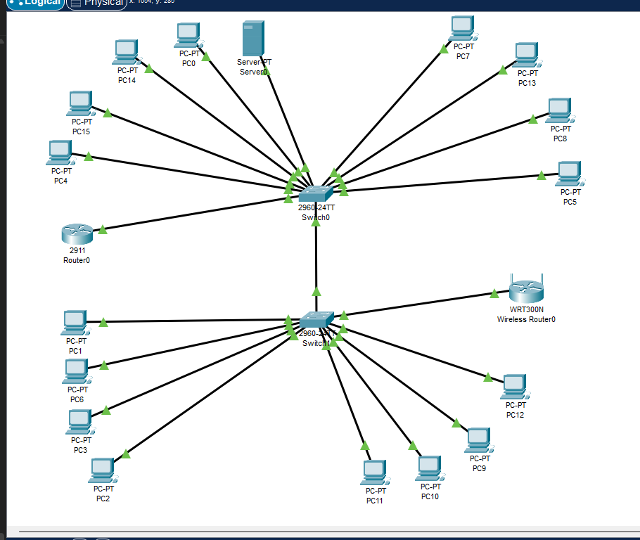
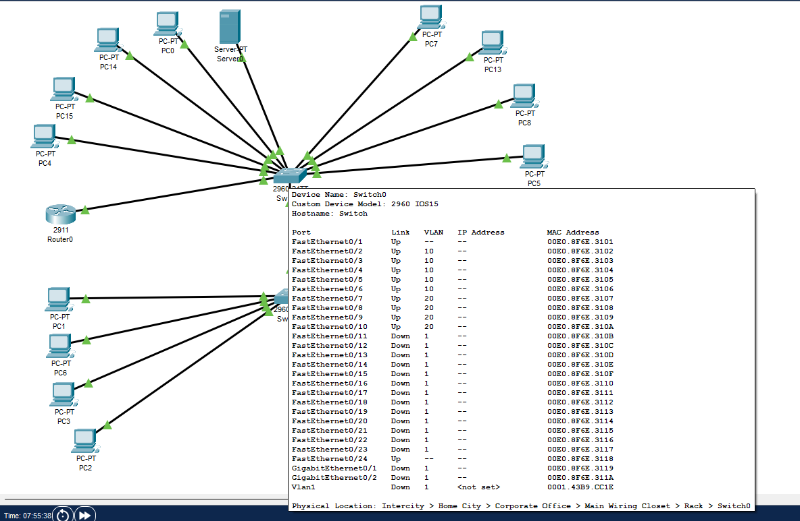
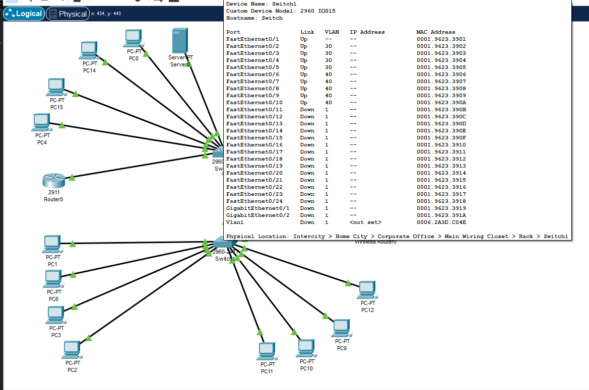
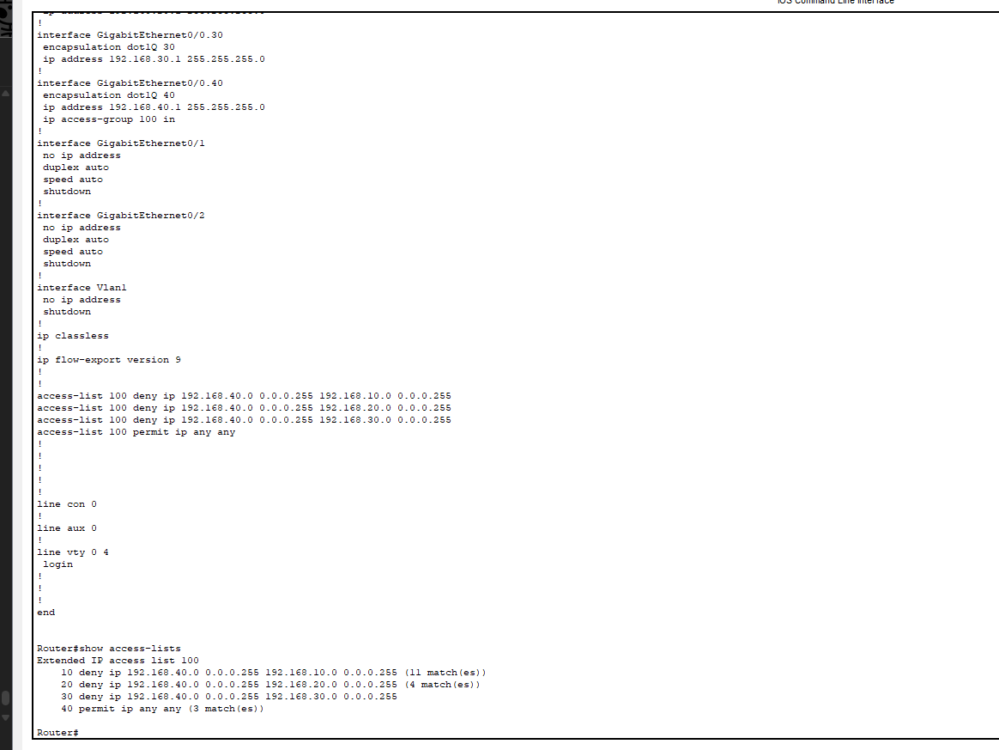

# SMB Network Redesign Project

This project simulates the design and implementation of a secure small-to-medium business (SMB) network using Cisco Packet Tracer. It focuses on VLAN segmentation, trunking, inter-VLAN routing, and ACL enforcement to isolate sensitive resources from guest access.

---

## 🔧 Technologies Used

- Cisco Packet Tracer
- VLANs & Trunking
- Router-on-a-Stick (Inter-VLAN Routing)
- Access Control Lists (ACLs)
- Layer 2 & Layer 3 CLI troubleshooting

---

## 🧭 Project Overview

### 🧱 VLAN Structure

| VLAN | Name     | Subnet             | Devices            |
|------|----------|--------------------|--------------------|
| 10   | Admin    | 192.168.10.0/24    | PCs + Server       |
| 20   | Finance  | 192.168.20.0/24    | Finance PCs        |
| 30   | HR       | 192.168.30.0/24    | HR PCs             |
| 40   | Guest    | 192.168.40.0/24    | Wi-Fi + Guest PCs  |

### 🌐 Features Implemented

- VLAN segmentation by department
- Trunk ports for inter-switch/router communication
- Router-on-a-stick configuration on a Cisco 2911
- ACLs to restrict Guest VLAN from accessing internal VLANs
- Full connectivity testing + troubleshooting

---

## 🖼️ Network Topology



---

## 🔍 Configuration Snapshots

### VLAN Setup

- **Switch 1 (Admin + Finance):**  
  

- **Switch 2 (HR + Guest):**  
  

### Router Subinterfaces + ACL

- **Subinterface Configuration:**  
  

- **ACL Hit Count (Verification):**  
  

---

## 🔐 Security: Guest VLAN Isolation

- Guest VLAN (`192.168.40.0/24`) is restricted from accessing:
  - Admin VLAN
  - Finance VLAN
  - HR VLAN
- ACL 100 applied to G0/0.40 on the router using inbound filtering

```plaintext
access-list 100 deny ip 192.168.40.0 0.0.0.255 192.168.10.0 0.0.0.255
access-list 100 deny ip 192.168.40.0 0.0.0.255 192.168.20.0 0.0.0.255
access-list 100 deny ip 192.168.40.0 0.0.0.255 192.168.30.0 0.0.0.255
access-list 100 permit ip any any
